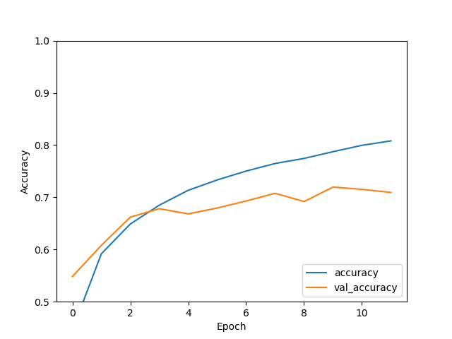

# Convolutional Neural Networks Labs

The objective of this lab is to give you hands-on experience designing a convolutional neural network (CNN).
These instructions will provide you with a basic CNN architecture, and provide you with default training
settings. This sample model has a mediocre performance. Your job is to use your knowledge about
model capacity, under/over fitting, and deep network architectures to improve the performance, i.e.,
reduce the testing error.   

## Setup your development environment
The code for this lab is in Python and uses the TensorFlow library. These instructions will teach you how
to edit and run the code in VS-Code, a commonly used coding editor with debugger, on your computer. 
You may use any editor and debugger that you like (e.g., Juptyer notebooks, Google Colab, Kagle, etc).
However, the instructions will assume you are using vs-code, and the instructor will be unable to provide
help for different editors. 

### Install Python 
[Download](https://www.python.org/downloads/) Python and follow the installation instructions for your OS

### Install VS-Code
[Download](https://code.visualstudio.com/Download) VS-Code and follow the installation instructions for your OS.

### Install the Python Extension in VS-Code
1. Open VS-Code 
2. Click on the Extension Icon or use the command `Ctrl+Shift+X`
3. Type "python" in the search box
4. Click on the extension called `Python` published by Microsoft
5. Click Install

### Additional Resources
If you need more details on how to install Python and the Python extension, please read these 
[guide](https://code.visualstudio.com/docs/python/python-tutorial)

## Getting the code 
After you have installed Python and the Python extension, download the code, save it to a new
folder, and then open the folder in VS-Code.

1. Click on the green button with the `Code` label on the top right of this page.
2. Click on `Download Zip`

Alternatively, you can use `git`. You can also copy and paste manually from the individual files. 

### Open the folder in VS-Code
1. Open VS-code
2. Click on the Explorer icon or press `Ctrl+Shift+E`
3. Click on `Open Folder`
4. Select and open the `cnn-lab` folder. 
5. You should see the lab files displayed on the file explorer column. 

## Code test drive
Before we start tinkering with the code, let's take a look at the various files, understand
what they do, and make sure they work.  

### The `data-exploration.py` file
This file downloads the CIFAR10 dataset and saves a sample of 25 images. The CIFAR10 dataset is
commonly used to measure the performance of a CNN.  As with any data science project, we start by doing
some data exploration. In this case, we are just going to take a look at a few images. 

To run the file, 
1. Open the `data-exploration.py` file. 
2. Press `Ctrl+Shift+D` to open the debug icon and then click `Run and debug`.
2. Alternatively, you can press `Ctrl+F5` to directly run the file.   

To open the sample images, 
1. Take a look at line 44. 
2. Open the file with the name specified in line 44. 

### The `build-cnn-model.py` file
This file builds a CNN model and saves it to a file. This is an important file as all the
design choices about the architecture of the model are coded here. 

Let's run the file and see the model that it creates. 
1. Run the file by pressing `Ctrl+F5`
2. Open the file with the name specified in line 70

#### Questions
1. Describe the architecture of the CNN. Provide details about the layers' size, type, and number. Also
   provide details about the activation functions used.
   *Answer:* Based on the image `cnn_model.png`, we can observe that the CNN is formed by 6 layers. 

   **Layer 1**: This is the input layer. It doesn't apply any processing but it tells our model
   the shape of the inputs.  In this case, we have an input with shape None, 32, 32, 3. This
   means the images are 32 by 32 pixels and have three channels one for each primary color. None allows
   the model to take any number of images at a time. Recall that we can process multiple inputs
   simultaneously. We call multiple inputs a batch. 

   **Layer 2**: This is the convolutional layer. It takes an input of size None, 32, 32, 3, and outputs a
   tensor of size None, 30, 30, 32. The input is no longer an image that makes sense to the human eye. 

   **Layer 3**: This is the maxpooling layer. Recall that convolutional layers are usually paired with a
   pooling layer. In this case, we are using maxpooling. The layer reduces the size of the tensor to
   None, 15, 15, 32. 

   **Layer 4**: Next, we add a flatten layer. So far, we have been dealing with tensors (i.e.,
   three-dimensional matrices). Since we are interested in classifying the images, we eventually want
   to have a vector of neurons of size 10, which is the number of classes. However, instead of jumping to
   a vector of size 10 we add an additional layer. This increases the model's capacity. The output of
   this layer is None, 7200. This layer doens't change the values, it simply "rolls out" the input. To
   see this we can multiply the dimensions of the input: 15x15x32=7200.

   **Layer 5**: This is a dense layer. The dense layer is a traditional feedforward layer where all
   inputs are connected to all outputs. We set the size of the output to 64. 

   **Layer 6**: This layer does the final prediction. It outputs 10 probabilities. Each probability
   corresponds to one class. Since we are using the `SparseCategoricalCrossEntropy`, TensorFlow takes a
   softmax operation to find the largest probability, and the compares that to the label. 

   The convolution and dense layers are both using the rectilinear activation function. 

   Here's the architecture figure you should be seeing
   
   

2. Build a two-column table. The first row should have the lines of code that define the
   layers. The second column should have a screen shot of the corresponding layer in the
   architecture figure.  
   *Answer 2*: 
   Layer 1 and Layer 2 are defined by 
   `model.add(tf.keras.layers.Conv2D(32, (3, 3), activation='relu', input_shape=(32, 32, 3)))`
   Layer 3 is defined by `model.add(tf.keras.layers.MaxPooling2D((2, 2)))`
   Layer 4 is defined by `model.add(tf.keras.layers.Flatten())`
   Layer 5 is defined by `model.add(tf.keras.layers.Dense(64, activation='relu'))`
   Layer 6 is defined by `model.add(tf.keras.layers.Dense(10)) `
 
   3. Draw the input and output tensors and label its sizes for each layer.
   You should be able to this based on the answer to the first question.  

### The `training.py` file
Now that we have defined the architecture of the model, we are ready to train it. The training algorithm
and parameter choices are coded in this file. The file also runs trains the model and then saves it to a
file. 

Lets run the file to train the model. 
1. Press `Ctrl+F5`

#### Questions
1. Which variables in the code are used as the training dataset by the function `fit`?
*Answer*: `train_images, train_labels`

2. Which variables in the code are used as the testing dataset by the function `fit`?
*Answer*: `test_images, test_labels`
3. Is accuracy a good performance measure? Why?
*Answer*: Accuracy is a good performance measure as long as there is a roughly equal number of
*training and testing sample for each category. The accuracy is calculates as correctly predicated sample
divided by the total number of predictions. However, if one of the categories has many more
samples, then even if we have a poor model that always predicts the dominant category, we would
still have high accuracy. 

4. Is categorical cross-entropy the appropriate loss function?  Why?
Yes. The reason is that we have multiple categories. 

### The `analysis.py` file
Now that we have a trained model, we can observe the training error, testing error, and accuracy. 

Run the file to generate the plots
1. Press `Ctrl+F5`
2. Open the accuracy plot (file name specified in line 22)
3. Open the loss plot (file name in line 35)

#### Questions
1. What is difference between validation and testing in this code? 
*Answer*. The difference between validation and testing is that the data that we are using for testing is
not used for training, and vice versa. 

2. What is the difference between training/testing loss and training/testing accuracy?
*Answer*. The training loss and accuracy are calcualted when the model predicts the label for samples in
the training dataset. The testing accuracy and loss are calculated when the model predicts labels in the
testing data set.

3. We are using the categorical cross-entropy (CCE) to measure the loss. 
   Would a larger CCE or smaller CCE result in a lower testing error?  
*Answer*. Our testing error is equal to the CCE itself. So, lower CCE means lower testing error. 

4. What is the accuracy of the model?
*Answer*. After one epoch, the accuracy is about 0.55. You can see this value in the 
`cnn-training-history.csv` file. 

5. Has the training/testing accuracy converged in the accuracy plot?
*Answer*. We cannot tell because we only had one epoch. 

6. Has the training/testing loss converged  in the loss plot?
*Answer*. We cannot tell because we only had one epoch. 

7. Did the difference between the training and testing loss/accuracy decreased or     
   increased across epochs? If it increased and decreased in the plot specify in which
   epochs it increased/decreased? 
*Answer*. We cannot tell because we only had one epoch. 

8. Give the potential reasons that can explain the low accuracy of the model (anything 
   below 90% is considered low)
*Answer*. Low accuracy can be due to low model capacity, over or under fitting, lack of enough
data, too few epochs, incorrect learning rate, etc. 

## Updating the code to improve performance. 
Now that you have a trained model, lets see if we can improve it. We can change the training
parameters and the model itself. 

### Updating the Training Parameters
1. Based on your answers to Q.5 in the `analysis.py` file [section](#the-analysispy-file), 
   make changes to the training parameters to improve the testing accuracy and loss. 
2. Describe your changes.
*Answer*. There are multiple possible changes to improve the accuracy. The first change that I
made was to increase the `epohcs` parameter in the `model.compile` function from 1 to 10. After,
changing the epochs to a larger value, we can observe the accuracy and loss plots and give a better
answer to the questions above. These are the plots I obtained after running 10 epochs. 

From these plots, we can observe that the testing error starts to increase around 8 epochs. If we choose,
to stay with this model, we would stop the training at 8 epochs. We also see that the accuracy maxes out
at around 60%. 

Lets see if we can do better. Next, I added a convolutional layer to my network by adding the following lines of code after the
original convolutional layer. 
`model.add(tf.keras.layers.Conv2D(32, (3, 3), activation='relu'))`
`model.add(tf.keras.layers.MaxPooling2D((2, 2)))`

I also increased the epochs from 10 to 12 in case the larger model needs more training. 

These are the plots I obtained with the new model. 

We see that the we can obtained an accuracy of about 70%, which is a 10% increase from the previous
model. 

We can continue extending the network with more layers to improve the testing accuracy. 

3. Run the
`training.py` and `analysis.py` files with your new parameters. 
4. Did the testing performance improve? Explain why or why not. 
*Answer* The model performance improved with the model that had an extra convolutional layer. The reason
is that the capacity of the model, i.e., the total number of functions as well as their complexity from which it can choose to model
the training data, is larger. This allows the model to find a more appropriate function. 

### CNN Model updates
1. Based on your answers to Q.5 in the `analysis.py` file [section](#the-analysispy-file), make changes to the
   CNN architecture. 
2. Describe your changes. 
3. Run the `training.py` and `analysis.py` files with your new parameters. 
4. Did the testing performance improve? Explain why or why not. 
